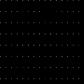
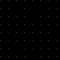
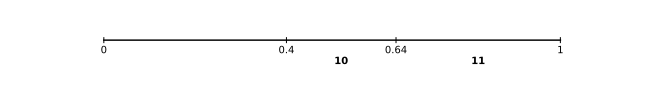

= 画像可逆圧縮手法 FLIF についてのメモ
:sectnums:
:xrefstyle: short

https://flif.info/[FLIF (Free Lossless Image Format)] は、実用されている可逆圧縮形式としておそらく現在最強の圧縮手法です。実際、画像圧縮手法に関する最近の研究では、 FLIF が比較対象となることが多いように思われます。このブログ記事では、 FLIF がどのように圧縮を行っているのか、理解できた範囲で記録していきます。

ファイル形式としての特徴は、アルファチャンネル対応、 HDR (サブピクセルが8ビットより大きい) 対応、アニメーション対応と、現代的な画像形式として一般的な構成となっています。

圧縮手法としての特徴は、次の2点が挙げられます。

. 色空間 (YCoCg) や画素値の範囲を変換することで、画素間の相関が大きくなり、効率よく符号化できるようにします。
. エントロピー符号化に使用する確率分布の使い分け（コンテキスト）を入力画像から決定木の形式で学習します。

FLIF は、すでに ImageMagick で実装されており、すぐに試すことができます。また、コーデックのリファレンス実装は GitHub にあります (https://github.com/FLIF-hub/FLIF:[FLIF-hub/FLIF])。

なお、現在 FLIF の開発はストップしており、 FLIF の成果は JPEG XL に取り込まれるようです。ただ https://gitlab.com/wg1/jpeg-xl/-/blob/bf10dc87f9b91cf2eb536b36362987a992b3c25f/doc/xl_overview.md#lossless:[JPEG XL の説明]を読む限り、以上に挙げた特徴とは違っているので、手法としては別物になるのではないかと思っています。

== 他の可逆圧縮手法との比較

（あんまり詳しくないので、ツッコミよろ）

現在 web でシェアを取っている PNG と WebP は、 Deflate のような辞書型圧縮が使用されています。 PNG や WebP の可逆圧縮モードでは、入力画像の画素値、または隣接画素を使った画素値の予測をしたときの誤差（残差）を Deflate のような手法で圧縮します。

FLIF は、このような辞書型圧縮 + ハフマン符号の構成ではなく、算術符号で符号化を行います。算術符号については後で説明します。

算術符号を使用する手法としては、 JPEG 2000 や H.264 があります。これらの手法では、2値に対する算術符号が使用されています。 FLIF もこれらの手法を参考にしつつ、ギリギリ特許と被らない手法を使用しています。

== FLIF ファイルの構成

FLIF ファイルは、大きく次のように構成されます。区切り方は https://flif.info/spec.html:[FLIF16 Specification] に従っています。

Main Header:: 画像の大きさやチャンネル数が記述されます。
Metadata:: 任意のデータを書き込めます。ここに Exif とかを入れます。
Second Header:: 圧縮に使用するパラメータが記述されます。ここで色空間やその他の変換をするのか、するならば変換に使用するパラメータを記述します。
Pixel Data:: Second Header で指定した変換がなされた画像のデータです。後で詳しく説明します。

== 画素値の符号化

画素値の符号化には2種類の方法が用意されています。

非インターレース (Non-interlaced):: 上の画素から順番に符号化していきます。デフォルトでは、総画素数が1万未満のときに使用されます。
インターレース (Interlaced):: 画像を 1/2, 1/4, 1/8, …… と縮小していき、小さいものから順に符号化していきます。画素値を予測するときに、小さい画像の画素値を使って予測を行うことができるので、非インターレースではできないような予測（予測しようとしている画素の右下の画素を使う）ができます。

=== 非インターレース方式

非インターレース方式では、 Pixel Data パートは次のような構造になります。

. MANIAC 符号化 (後述) に使用する決定木
. チャンネルごとに、画素値を左上からラスタスキャンの順に MANIAC 符号化したデータ

実際に符号化する画素値は、予測された画素値との誤差になります。予測に使用する画素は、次に示すように、予測する画素 X の左上、上、左です。

+++
<pre> +---+---+
 | TL| T |
 +---+---+
 | L | X |
 +---+---+</pre>
+++

予測値は、 L+T-TL, L, T の中央値です。 X-予測値 が実際に符号化される値になります。

アルファチャンネルがある場合、アルファチャンネルが一番最初に符号化されます。なぜなら、 Second Header の項目に、透明ピクセルのデータを捨てる（Aが0ならRGBの値は未定義にする）オプションがあるため、ある座標が透明ピクセルかどうかがわからないと他のチャンネルを符号化・複合化できないからです。アルファチャンネル以外については、 YCoCg はその順番で、 RGB は Second Header の変換で PermutePlanes が指定されているかどうかで決まります。

=== インターレース方式

大きいサイズの画像に対しては、非インターレース方式よりも複雑ですが、予測精度の高い手法を用いることで、圧縮効率を稼ぎます。インターレース方式では小さい画像から段々と大きい画像を復元していきます。 PNG だとインターレースを使用するメリットは読み込み途中でも画像を表示できるという程度ですが、 FLIF では圧縮率に貢献します。

次の表は実際のデコード処理中のデータを Y チャンネル（輝度値）について取り出したものです。この場合では、ズームレベル 14 から順番に復元していきます。

.インターレース方式で画素が復元される様子
|===
|ズームレベル |サイズ |画像

|0 |120×120 (原画像サイズ)
|

|1 |120×60
|image:interlace/dec_i00_fr00_z01_p00.png["ZL=1"]

|2 |60×60
|image:interlace/dec_rough_i30_fr00_z02_p00.png["ZL=2"]

|3 |60×30
|

|4 |30×30
|image:interlace/dec_rough_i24_fr00_z04_p00.png["ZL=4"]

|5 |30×15
|

|6 |15×15
|image:interlace/dec_rough_i18_fr00_z06_p00.png["ZL=6"]

|7 |15×8
|

|8 |8×8
|

|9 |8×4
|image:interlace/dec_rough_i09_fr00_z09_p00.png["ZL=9"]

|10 |4×4
|

|11 |4×2
|image:interlace/dec_rough_i04_fr00_z11_p00.png["ZL=11"]

|12 |2×2
|image:interlace/dec_rough_i02_fr00_z12_p00.png["ZL=12"]

|13 |2×1
|image:interlace/dec_rough_i01_fr00_z13_p00.png["ZL=13"]

|14 |1×1
|image:interlace/dec_rough_i00_fr00_z14_p00.png["ZL=14"]
|===

具体的なアルゴリズムを書くと長くなるので、以上のように画素が埋まっていくんだなと解釈してください（雑）。最後のズームレベルは 1×1 になるので、より大きな画像ではズームレベルがさらに多くなります。また、横長、縦長の画像では、あるズームレベルで 1 ピクセルも復元されないことがあります。

このように圧縮すると何がうれしいかというと、すでにデコードされている隣接画素の情報を画素値予測に使うことができることができます。図からも 4×4 くらいになれば、手がかりになりそうなデータになっていることが分かると思います。実際、インターレース方式で使用する予測器は、非インターレース方式の予測器よりもリッチです。

予測器はズームレベルが偶数か奇数かで少し挙動が変わります。なぜなら周囲の画素のデコード状況が異なるからです。偶数では行をデコードするため、デコードする下側の画素を参照することができますが、右側を参照することはできません。奇数では列をデコードするため、逆に右側を参照することできますが、下側を参照することができません。（TODO: これ図が欲しい）

実際の予測器を見てみましょう。予測する画素 X の周辺画素に次のように名前を付けておきます。このうち、ズームレベル偶数では R を参照することはできず、奇数では B を参照することができません。

+++
<pre> +---+---+---+---+
 |   |   | TT|   |
 +---+---+---+---+
 |   | TL| T | TR|
 +---+---+---+---+
 | LL| L | X | R |
 +---+---+---+---+
 |   | BL| B | BR|
 +---+---+---+---+</pre>
+++

予測器は次の3つから選ぶことができます。チャンネルごとに指定するかズームレベルごとに指定するかが選べます。リファレンス実装のデフォルトでは、チャンネルごとにズームレベル 0 と 1 で試しにすべての予測器で予測させて、誤差が一番少ないものを選択します。

.インターレース方式における予測器
[cols="1,2a,2a"]
|===
|予測器 |ズームレベル偶数 |ズームレベル奇数

|0
|(T + B) >> 1
|(L + R) >> 1

|1
|次の中央値

* (T + B) >> 1
* L + T - TL
* L + B - BL

|次の中央値

* (L + R) >> 1
* L + T - TL
* R + T - TR

|2
|次の中央値

* T
* B
* L

|次の中央値

* T
* L
* R
|===

「>> 1」は 2 で割って切り捨てなので、平均を求めていることになります。予測器 0 では両隣の平均、予測器 1 では斜め方向も含めて計算してみて中央値を取る、予測器 3 では周囲の中央値を取るという戦略になっています。予測器で使われない TT や LL といった画素は、この後説明する決定木の条件として参照されます。

TODO: rough について

== 符号化

それでは、予測値の誤差をどのようにビット表現に変換しているのかについて説明していきましょう。 FLIF ではこの符号化手法のことを MANIAC (Meta-Adaptive Near-zero Integer Arithmetic Coding) と呼んでいます。ここでは、算術符号 (Arithmetic Coding)、適応的算術符号 (Adaptive Arithmtic Coding)、 Near-zero Integer Coding、 Meta-Adaptive Arithmetic Coding に分割して説明していきたいと思います。

=== 算術符号

==== 実数による算術符号

算術符号は、記号の出現確率分布（累積分布）を表す数直線上で、符号化したい記号列がどの位置にあるのか、を記録する符号化方式です。

まずは簡単な概念の説明のために、0～1の実数で考えてみます。 FLIF で使用される算術符号では「0」と「1」の2種類の記号だけが登場する（二値算術符号）記号列を扱うので、ここでも2種類の記号で考えます。例えば、「0」が 40% 、「1」が 60% の確率で出現することがわかっているとします。この確率によって、 0～1 の数直線を分割すると、このようになります。数直線上に点を置いたとき 0～0.4 の範囲にあるならば 0、 0.4～1 ならば 1 を表している、と解釈できます。

では、この分割を再帰的に用いて、記号列「101」を数直線上に表してみましょう。

最初の記号は 1 なので、 0.4～1 の範囲に注目します。この範囲をさらに 40:60 に分割するとこのようになります。

2個目の記号は 0 なので、次は 0.4～0.64 の範囲に注目し、同じように分割します。

この結果から、記号列「101」をこの数直線上に表すと 0.496～0.64 の範囲となることがわかりました！ 符号化結果としては、範囲の左端を使って「0.496」とすることにしましょう。このように、記号列を記号の出現確率を使って数直線上に表す方法が、算術符号になります。複合化するときは、「0.496」がどの記号の範囲に含まれているかを、同じように分割しながら探索していきます。

==== Range Coder

先ほどの例では実数を使って表しましたが、記号列が長くなると相当な精度の小数を使用しなければ正しく符号化結果を記録できないことがわかると思います。また小数を使用すると計算速度も遅くなります。そこで、現実的な実装方法として、整数を使用する Range Coder という手法が用いられます。 FLIF のリファレンス実装のソースコードでは「RAC」と略されています。

Range Coder では、正しく符号化結果を記録できるだけの長さ（整数）を持つ数直線上に、記号列をプロットします。とはいえ、その「十分な長さ」がどれだけ長くなるかわからないので、最初の数直線の長さを決めておき、注目範囲が閾値より小さくなったら、数直線の長さを拡張します。 FLIF では、最初の数直線の長さを 24 ビット、閾値を 16 ビットとしています。数直線の長さを拡張する際、そのとき注目している範囲の左端の上位ビット（ここでは差が 8 ビットなので 8 ビット分）を出力します。なぜなら、左端はこれ以上符号化を進めても、現在の右端を超えることはないため、上位ビットの値はほぼ決まっているからです（場合によっては桁上がりが発生して、上位ビットが変わることがあるため、少し工夫が必要です）。

詳細なアルゴリズムについては、私よりもうまい説明に任せたいと思います。

* http://fussy.web.fc2.com/algo/compress10_arithmetic.htm:[圧縮アルゴリズム (10) 算術符号化] (Fussy's HOMEPAGE)
* http://www.nct9.ne.jp/m_hiroi/light/pyalgo36.html:[Algorithms with Python / レンジコーダ (range coder)]

==== コンテキスト

二値のエントロピー符号化全般として、圧縮率を良くするためには、出現確率が 0 と 1 のどちらかに極端に偏っているほうがうれしいです。

例えば、4ビットの整数を3個並べたビット列を、算術符号化することを考えてみます。 10, 11, 12 をそのままビット列にすると「1010 1011 1100」となり、 0 の出現確率は 0.417、 1 の出現確率は 0.583 となります。この確率分布で算術符号化しようとすると、出現確率が 0.5 に近く、圧縮する意味がほとんどないことがわかると思います。

しかし、見方を変えると偏った分布に見えます。4ビット整数の最上位ビットだけをみると全部 1 です。さすがに 100% の確率で 1 が出現する、としてしまうと、もし 0 が出てしまったときに符号化不可能になってしまいますが、 1 の出現確率を大きくすることで、これらのビットを効率よく圧縮できます。つまり言いたいことは、ビット列をただそのままビット列として見るのではなく、ビットの持つ意味（この例では整数の何ビット目か）ごとに確率分布を変えることで、圧縮率を改善できるということです。意味ごとの確率分布をコンテキストと呼びます。

=== 適応的算術符号

先ほどの例では 0 と 1 の出現確率が分かっているという前提がありました。つまり符号化・複合化を行うには、事前に出現確率を仮定しておくか、出力に出現確率を記録するかをしなければいけません。しかし、雑に出現確率を仮定して符号化をすると、もし実際の記号列が仮定した出現確率と異なる分布だった場合、圧縮率は悪化してしまいます。そこで、出現確率を記録しておく必要はなく、雑な出現確率の仮定で、それなりに圧縮率を改善する方法として、符号化を行いながら、確率を変化させる手法があります。実際の記号列に適応していくことから、適応的 (adaptive) と呼ばれます。コンテキストを使用する場合は、コンテキストごとに別々に適応させていくことができます。

FLIF で使用されている適応方法は非常に簡単なものです。初期の出現確率は仕様で指定されています。1ビットを符号化する（数直線を変化させる）たびに、出現確率を変化させます。変化量は、ビットが 0 ならば、 0 の出現確率を少し増やす、 1 ならば 1 の出現確率を少し増やすというものです。

=== Near-zero Integer Coding

FLIF では、各画素について、予測値からの誤差（整数）を記録します。予測が当たれば誤差は 0 に、当たらなくても大抵は近い値になるので誤差は 0 前後になるはずです。そこで、 0 に近いほどビット数が少なく済むような方法で、誤差を記録します。

ビット列は、次のような構成になっています: ゼロ、正負符号、指数、仮数

もし値がゼロなら、ゼロフラグを 1 としておしまいです。そうでなければ、正(1)か負(0)か、何ビットあるか、数値のビット列、の順で記録します。

例えば、「5」を符号化すると次のようになります。

.「5」を Near-zero Integer Coding で符号化
[[tbl-nz51]]
[cols="h,7*^"]
|===
|ビット |0 |1 |0 |0 |1 |0 |1
|コンテキスト
|ZERO
|SIGN
|EXP(0, +)
|EXP(1, +)
|EXP(2, +)
|MANT(1)
|MANT(0)
|===

指数部、数値が何ビットあるかは 0 が連続した数で決まります。この例では、 0 が 2 個続き、その次が 1 なので、 3 ビットの数値を表していることを表現しています。

仮数部は、最上位ビット以外の値がそのまま出力されます。何ビットあるかが指数部で示されているので、最上位ビットは 1 であることが確定しています。

ただし、数値の取りうる範囲によっては、一部ビットが省略されることがあります。ここでは最小値を任意の負値、最大値を 5 として、 5 を符号化した例を見てみましょう。

.「5」を最大値 5 の Near-zero Integer Coding で符号化
[[tbl-nz52]]
[cols="h,5*^"]
|===
|ビット |0 |1 |0 |0 |1
|コンテキスト
|ZERO
|SIGN
|EXP(0, +)
|EXP(1, +)
|MANT(0)
|===

まず、指数部の最後のビットが省略されました。なぜなら、最大値 5 は 3 ビットで表されるので 0 が 2 個続いた時点で、 3 ビットであることが確定するからです。次に仮数部の下位2ビット目が省略されました。なぜなら、 3 ビットで表す必要がある数値は 4 または 5 だけなので、下位 2 ビット目は必ず 0 になることが確定しているからです。このように実際に書き込まなくてもわかる場合は、ビットを省略する動作をします。

<<tbl-nz51>>、<<tbl-nz52>>には、コンテキストという行を用意しました。これは <<_コンテキスト>> で説明したコンテキストが実際どのように使用されているのかを表す例です。それぞれのビットにコンテキストが割り当てられています。そして、それぞれ適応が行われます。つまり予測器の出力が 0 になることが多ければ ZERO が 1 になる確率が適応によって段々と大きくなるし、正になることが多ければ SIGN が 1 になる確率が適応によって段々と大きくなるということです。指数部については第2引数に「+」と書いたように SIGN によって異なるコンテキストを使用します。各コンテキストにおける初期確率は、仕様に記述されています。

=== コンテキストと決定木
