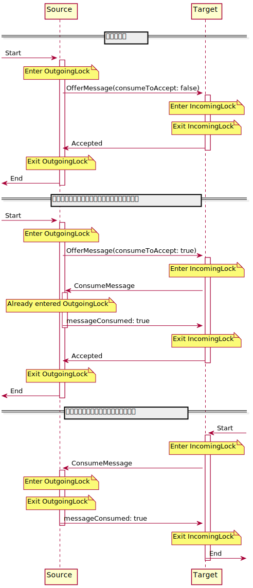
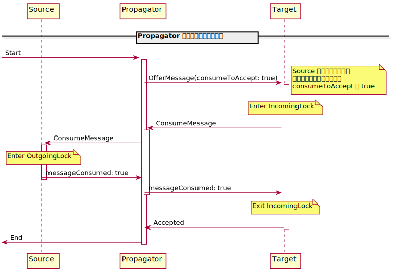
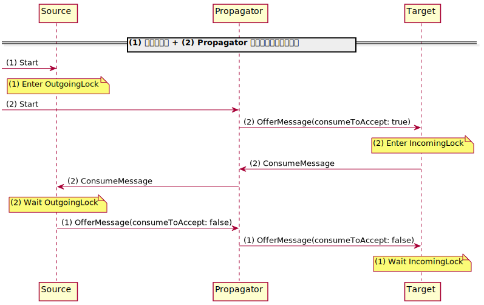

# バッファのない PropagatorBlock はつくれないという話

また TPL Dataflow の話です。突然ですが、バッファのない PropagatorBlock って欲しくないですか？

例えば、複数の SourceBlock があって、それをひとつの SourceBlock として返したいとき。

```cs
ISourceBlock<T> CreateSource()
{
    IEnumerable<ISourceBlock<T>> sources = /* ... */;

    var resultBlock = new BufferBlock<T>(new DataflowBlockOptions() { BoundedCapacity = 1 });
    foreach (var s in sources) s.LinkTo(resultBlock);

    return resultBlock;
}
```

どうでしょう？ `resultBlock` は、1件はバッファに持ってしまうので、後段のブロックがどうであれ、ソースからは必ず1件多く取り出されてしまいます。

1件くらいいいじゃない？ それは `sources` 次第でしょう。

というわけで、本題のバッファのない PropagatorBlock が欲しい、ということです。もし `resultBlock` にバッファがなければ、 `CreateSource` の戻り値を利用する（リンクする）とき、初めて `sources` からデータが取り出されます。やりたいですね。

## タイトルオチ

もうタイトルでオチてますが、このような PropagatorBlock はデータフローブロックのプロトコル上、おそらく作れません。プロトコルについては[以前](https://blog.azyobuzi.net/2020/04/30/01-reactivestreams/ "プロトコルから比較する Reactive Streams と TPL Dataflow")ざっくりと紹介しましたが、今回はこのプロトコルと、既存のブロックの実装で使われているロックが鍵となります。

TPL Dataflow のブロック間の通信は、完全に直列です。ある SourceBlock からは同時に1件しか送信しないし、ある TargetBlock は同時に1件しか受信できません。その制御は `lock` ステートメントで行われています（絶対ボトルネックじゃん）。

PropagatorBlock は Source と Target 両方の性質を持っており、 Target で受信したデータを加工して Source がデータを出力します。 Target 部は1件ずつ受信を行い、加工を行うタスクへ投げ、加工が終わったデータは Source 部のキューに積まれ、 Source 部は1件ずつ送信を行います。つまり PropagatorBlock においては Target と Source は並列に動いています。

TPL Dataflow のソースコードを読むと、 TargetBlock または PropagatorBlock の Target 部を直列化するために使用されるロックを `IncomingLock`、 SourceBlock または PropagatorBlock の Source 部を直列化するために使用されるロックを `OutgoingLock` と呼んでいるので、この名称を使っていきます。

では、このロックを考慮しながら、 Source から Target へデータを送信する各パターンをシーケンス図に表してみます。

<figure class="fig-img"></figure>

もう複数のロックがあるという時点で嫌ですね。

ではここで、間にバッファのない PropagatorBlock が入ったらどうなるでしょう？ 変わりませんね。通信内容をそのまま素通しすればいいだけなので。しかし忘れてはいけないことがあります: 間に入るブロックもブロックなので、ファンインもファンアウトも複数持つことができます。したがって、今注目していた Source と Target 以外の要因によって通信が発生することがあります。例えば、別の Target にデータを送信できたので、次の1件の送信を開始しよう、とすると次の操作が開始します。

<figure class="fig-img"></figure>

そろそろ嫌な予感がしてきましたね。 Propagator は Source の OutgoingLock なんてお構いなしに Target にデータの送信を試みることができます。つまり、タイミングによっては……。実際に例を見てみましょう。 Source が Propagator に送信しようとしたら、 Propagator が Target に送信中だった場合、こうなります。

<figure class="fig-img"></figure>

見事なデッドロックですね。並行にロックを取得する場合、取得順を同じにしないとデッドロックするという鉄則がありますが、完全に破る構図です。

ただ、このデッドロックは実は回避できます。「(1) OfferMessage」のところで Propagator が「(2) ConsumeMessage」を実行中でまだ返ってきてないぞと判断して、このメッセージを延期させてしまえば、 OutgoingLock が外れるので先に進むことができます。

今の例では、 Source, Propagator, Target が 1:1:1 だったので回避できました。が、1:N:1、つまりひとつの Source が複数の Propagator に接続されていて、さらにその Propagator たちがひとつの Target に接続されている場合はどうでしょう。先程の図の (1) が Propagator1 で、 (2) が Propagator2 で起こっていたら、 Propagator 同士はお互いを知らないので調停することができません。

## まとめ

バッファを持たない PropagatorBlock は、デッドロックを起こす運命にあります。回避可能なケースは Source, Propagator, Target が 1:1:1 の関係にあるときです。例えば、 [`LinkTo` メソッドの `predicate` 引数を持つオーバーロード](https://docs.microsoft.com/ja-jp/dotnet/api/system.threading.tasks.dataflow.dataflowblock.linkto?view=net-5.0#System_Threading_Tasks_Dataflow_DataflowBlock_LinkTo__1_System_Threading_Tasks_Dataflow_ISourceBlock___0__System_Threading_Tasks_Dataflow_ITargetBlock___0__System_Predicate___0__)は、内部で PropagatorBlock を作成しています。しかしこのブロックは外部へ公開されず、あくまでリンクのために隠蔽されています。通常のブロックとして、複数のファンイン、ファンアウトを持てるという要件を満たそうとすると、不可能になります。

結局この記事で何が言いたかったかというと、拙作の TPL Dataflow 補助ライブラリの [BiDaFlow](https://github.com/azyobuzin/BiDaFlow) で、バッファなしの `TransformBlock` を提供していたのですが、デッドロックの可能性を排除できなかったので、機能を削除することにしました。悲しい。
