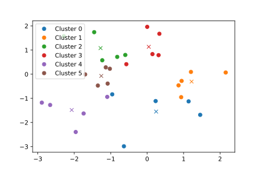
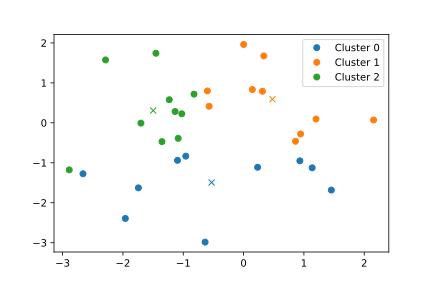
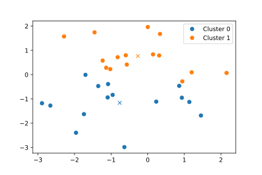

# クラスタサイズを指定できるk-meansベースのクラスタリング手法を実装した話

あけましておめでとうございます。季節感もなにもないブログですが、修論締切間近の時期に研究で使った技術をまとめようという点は季節感かもしれません。

今回のネタは、クラスタサイズに制約を設けてクラスタリングをしようという話です。

クラスタリングといったら、もっとも代表的な手法は k-means です。 k-means は<b>クラスタ数</b>を事前に指定して、クラスタリングを行います。つまり、 k-means を使うときは、データを <var>k</var> 個に分けたら何か傾向が見えるかもな～という気持ちで使うことになります。このとき、1クラスタに属するデータ数（<b>クラスタサイズ</b>）は、クラスタごとに異なります。

では、クラスタサイズを事前に指定するような方法はないのでしょうか。データが大量にあるので、データを <var>c</var> 個に均等に分割して処理したいな～というときに、どうしたらいいのでしょうか。というわけで今日の論文紹介です。

- [最適化に基づくマージン付きサイズ均等クラスタリングアルゴリズム](https://www.jstage.jst.go.jp/article/fss/32/0/32_329/_article/-char/ja)
- [Controlled-sized clustering based on optimization](https://ieeexplore.ieee.org/document/8023341)

上が日本語版、下が英語版で、書いてあることは同じです。この論文では、クラスタサイズの基準 <var>K</var> と、クラスタサイズの下限 $\underline{K}$ 、上限 $\overline{K}$ を指定すると、クラスタサイズがこの範囲内に収まるようにいい感じにクラスタリングする方法が示されています。英語版では、このアルゴリズムを COCBO と呼んでいるので、この記事でも COCBO と呼んでいこうと思います。

## アルゴリズムの説明

パラメータは、クラスタサイズの基準 <var>K</var> と、クラスタサイズの下限 $\underline{K}$ 、上限 $\overline{K}$ です。このとき、このアルゴリズムを使うと、$c = \left\lfloor \frac{n}{K} \right\rfloor$ 個（<var>n</var> はデータ数）のクラスタにクラスタリングすることができます。ただし、以下の条件を満たす必要があります。

$$
\begin{align}
\underline{K} & \leq K \\
\overline{K} & \geq K+1 \\
0 < n & \leq (K+1) \left\lfloor \frac{n}{K} \right\rfloor
\end{align}
$$

最後の条件は、次に説明する最適化問題を解いたときに、すべてのデータをいずれかのクラスタに属させることができるかを表しています。

では、アルゴリズムの中身に行きます。アルゴリズムのベースは k-means ですが、データがどのクラスタに属するかを計算する部分が異なります。 k-means では、各データがもっとも近い重心のクラスタに属するよう帰属度を更新していました。この部分を、クラスタサイズを制約条件とする線形計画問題として解いてしまおうというのが、 COCBO のアイデアです。別の言い方をすると、先の条件を満たしていれば、この問題は線形計画法で解けるという発見です。

アルゴリズムの流れはこのようになります。

1. 初期のクラスタ重心を設定する。データからランダムに <var>c</var> 個を選んで重心にすれば良い。
2. 帰属度（データがどのクラスタに属するか）を更新する。
3. クラスタ重心を更新する。重心は、クラスタに属するデータの平均となる。
4. クラスタ重心が変化しなければ終了、そうでなければ、2へ。

手順2以外は k-means と同じになります。

では、どのように帰属度を求めるのか見ていきましょう。まず記号を定義していきます。クラスタ重心を $v_i \ (i=1,\cdots,c)$ と表します。帰属度を $u_{ki} \ (k=1,\cdots,n, \quad i=1,\cdots,c)$ と表します。データ $x_k$ がクラスタ <var>i</var> に属するときを $u_{ki}=1$ 、そうでないときを $u_{ki}=0$ と表します。

このとき、次の目的関数を最小化する問題を考えます。目的変数はすべての $u_{ki}$ です。つまり重心からの距離を最小化するような帰属度を求めるということです。

$$
\begin{equation}
J = \sum_{k=1}^n \sum_{i=1}^c u_{ki} \| x_k - v_i \| ^2
\end{equation}
$$

制約条件は、次のふたつです。

$$
\begin{align}
\sum_{i=1}^c u_{ki} = 1 \quad & (k=1,\cdots,n) \\
\underline{K} \leq \sum_{k=1}^n u_{ki} \leq \overline{K} \quad & (i=1,\cdots,c)
\end{align}
$$

ひとつ目は、データはひとつのクラスタだけに属していることを表します。ふたつ目は、各クラスタがクラスタサイズ制約を満たしていることを表します。ひとつ目の制約は、すべての <var>k</var> について考える必要があり、ふたつ目の制約は、すべての <var>i</var> について考える必要があります。つまり、制約条件は $n + c$ 個あります。

この最適化問題はシンプレックス法で解くことができます。シンプレックス法って何？ 調べてみましたが、行列で連立方程式を解く懐かしく面倒くさい方法を思い出させられたのでつらくなりました。 Wikipedia によれば、計算回数は、ほとんどの場合、変数の数か制約条件の数の大きい方の回数だけ反復することになるらしいので、このアルゴリズムでは大体 $nc$ 回の計算をすれば解けることがわかります。

## mlpack と GLPK を使って実装する

シンプレックス法に入力できる制約条件はわかりましたが、アルゴリズムは頭が理解を拒否するので、線形計画問題を解いてくれるライブラリを使っていきます。 <kbd>apt search</kbd> で良いライブラリがないか探していたところ、 [GLPK (GNU Linear Programming Kit)](https://www.gnu.org/software/glpk/) というのを見つけたので、これを使っていきます。他にも線形計画問題を解くライブラリはありますが、使えるかは調べていません。今回解く問題では、目的変数の値が0か1しか取れないという条件があるので、これを表せる必要があります。

それから、 C++ 界の numpy として、 [mlpack](https://www.mlpack.org/) と [Armadillo](http://arma.sourceforge.net/) を使っていきます。 mlpack には [k-means の実装](https://www.mlpack.org/doc/stable/doxygen/classmlpack_1_1kmeans_1_1KMeans.html)があるので、それに似せて作っていきましょう。

まず、作成する関数のシグネチャです。

```cpp
#include <mlpack/core.hpp>

void ClusterWithCocbo(const arma::mat &data, size_t K, size_t lower_bound,
                      size_t upper_bound, arma::Row<size_t> &assignments,
                      arma::mat &centroids, size_t max_iterations = 1000);
```

入力引数に、データとパラメータ、最大繰り返し回数を取り、出力引数に、各データがどのクラスタに属するかと、重心を取ります。 <var>data</var> はひとつのデータを縦ベクトルとした行列です。つまり、行数がデータの次元数、列数がデータ数となります。

では、手順1から実装していきましょう。初期重心を求めます。これは mlpack の k-means の実装をそのまま使ってしまいます。

```cpp
// 必要なヘッダー
// #include <mlpack/methods/kmeans/sample_initialization.hpp>

size_t n = data.n_cols; // データ数
size_t c = n / K; // クラスタ数

// K の条件
assert(n > 0 && n <= (K + 1) * c);

// ランダムに c 個のデータを選んで重心とする
// mlpack の初期重心計算をそのまま利用
mlpack::kmeans::SampleInitialization().Cluster(data, c, centroids);
```

それでは、本題の、帰属度を線形計画法で解くのを GLPK を使って実装していきます。 GLPK の公式ドキュメントは、[ダウンロードサイト](http://ftp.gnu.org/gnu/glpk/)からソースコードをダウンロードすると、アーカイブの doc ディレクトリに PDF 形式で入っています。

まずは、最適化問題を表すオブジェクトを作成します。

```cpp
// 必要なヘッダー
// #include <glpk.h>

glp_prob *lp = glp_create_prob();
```

次に、問題が最大化問題か最小化問題かを指定します。ただし、デフォルトで最小化問題となっているので、これは書かなくても大丈夫です。

```cpp
glp_set_obj_dir(lp, GLP_MIN);
// 最大化問題ならば GLP_MAX
```

次に、制約条件の行列を考えます。制約条件の行列とは、次の図の <var>a</var> のことです。この行列を定義していくことで、 GLPK に問題を与えることができます。

<figure class="fig-img">

<figcaption>制約条件の行列とは</figcaption>
</figure>

まずは、目的関数を考えましょう。目的関数の項の数が行列の列数になります。目的関数は、式(4)から、 $nc$ 個の項を持つことがわかります。というわけで、まずはこれを GLPK に設定していきます。

```cpp
glp_add_cols(lp, n * c);
```

これで、 $nc$ 個の変数の存在を設定できました。この $nc$ 個の変数とは何かというと、帰属度 $u_{ki}$ です。帰属度は 0 か 1 しか値を取りません。 GLPK では、変数を二値や離散値にすることができるので、これを設定していきます。

```cpp
for (size_t k = 0; k < n; k++) {
  for (size_t i = 0; i < c; i++) {
    glp_set_col_kind(lp, k * c + i + 1, GLP_BV);
    // GLP_IV で離散値、 GLP_BV で二値にできます。
    // 第2引数は、何番目の変数について設定するかを表していますが、最初の変数を1とすることに注意してください。
  }
}
```

これで列方向の設定は完了です。次に、行方向（制約条件）を設定していきましょう。制約条件は全部で $n + c$ 個あることを先ほど示しました。列と同じように、 GLPK に行を追加していきます。

```cpp
glp_add_rows(lp, n + c);
```

それでは、ひとつ目の制約条件 $\sum_{i=1}^c u_{ki} = 1 \ (k=1,\cdots,n)$ を実装していきましょう。この条件はすべての $k=1,\cdots,n$ について別々の制約条件であると考えます。このとき、 <var>k</var> を固定したときの $u_{ki}$ の和が 1 であることを示します。つまり、展開すると次のようになります。

$$
\begin{equation}
0u_{1,1}+\cdots+0u_{k-1,c}+1u_{k,1}+\cdots+1u_{k,c}+0u_{k+1,1}+\cdots+0u_{n,c} = 1
\end{equation}
$$

GLPK では制約行列がスパースであると仮定しているので、係数が1であるところだけを GLPK に伝えれば良いわけです。これは、このように実装できます。

```cpp
for (size_t k = 0; k < n; k++) {
  int row_idx = k + 1; // k番目の制約条件

  // 制約条件の下限と上限を設定する。 GLP_FX は = を表す。
  glp_set_row_bnds(lp, row_idx, GLP_FX, 1, 1);

  // GLPK に渡すデータを作る。何列目に何の値を代入するかという形式で渡す。
  // 配列の 0 番目は使われないことに注意。
  // ※ 説明のためにここで定義していますが、ループの外に出したほうがパフォーマンスが良くなります。
  std::vector<int> indices(c + 1); // 行列の何列目に代入する？
  std::vector<double> ones(c + 1, 1); // 係数（この問題では 1 しか出てこない）
  for (size_t i = 0; i < c; i++)
    indices[i + 1] = k * c + i + 1;
  // c 個の係数を設定
  glp_set_mat_row(lp, row_idx, c, indices.data(), ones.data());
}
```

ふたつ目の制約条件も行ってみましょう。制約条件 $\underline{K} \leq \sum_{k=1}^n u_{ki} \leq \overline{K} \ (i=1,\cdots,c)$ は、展開するとこのようになります。

$$
\underline{K} \leq 0u_{1,1} + \cdots + 0u_{1,i-1} + 1u_{1,i} + 0u_{1,i+1} + \cdots + 0u_{2,i-1} + 1u_{2,i} + 0u_{2,i+1} + \cdots 0u_{n,c} \leq \overline{K}
$$

実装方法は、ひとつ目と同じ感じです。

```cpp
// ひとつ目とループの入れ子構造が逆！
for (size_t i = 0; i < c; i++) {
  int row_idx = n + i + 1; // n+i番目の制約条件

  // 制約条件の下限と上限を設定する。 GLP_DB は指定した両端を含む条件となる。
  glp_set_row_bnds(lp, row_idx, GLP_DB, lower_bound, upper_bound);

  std::vector<int> indices(n + 1);
  std::vector<double> ones(n + 1, 1);
  for (size_t k = 0; k < n; k++)
    indices[k + 1] = k * c + i + 1;
  // n 個の係数を設定
  glp_set_mat_row(lp, row_idx, n, indices.data(), ones.data());
}
```

これで、制約条件行列は完成です！ ここから先は手順2～4なので、ループの中にはいっていきます。

帰属度の計算をやっていきます。まず、現在の重心を使って、目的関数の係数を設定します。目的関数（式(4)ですよ！）の係数は、 $\| x_k - v_i \| ^2$ 、つまりデータと重心の距離です。これを計算して GLPK に設定していきます。距離の計算は、 mlpack に任せてしまいましょう。

```cpp
mlpack::metric::EuclideanDistance metric;

for (size_t k = 0; k < n; k++) {
  for (size_t i = 0; i < c; i++) {
    double distance = metric.Evaluate(
      data.col(k), // データは縦ベクトル
      centroids.col(i));
    glp_set_obj_coef(lp, k * c + i + 1, distance);
  }
}
```

これで目的関数も制約条件もすべて揃いました。あとは GLPK に計算をぶん投げましょう。

```cpp
int solve_result = glp_simplex(lp, nullptr);
// 戻り値が 0 なら成功
```

得られた結果（変数の値）は `glp_get_col_prim` 関数で取得することができます。 $u_{ki}=1$ ならば、 <var>k</var> 番目のデータは、クラスタ <var>i</var> に属しているということになります。これを <var>assignments</var> に代入していきましょう。

```cpp
assignments.zeros(n); // 初期化

for (size_t k = 0; k < n; k++) {
  for (size_t i = 0; i < c; i++) {
    double u = glp_get_col_prim(lp, k * c + i + 1);

    // GLP_BV なので 0 か 1 しか取らないはず
    assert(u == 0 || u == 1);

    if (u == 1) {
      assignments(k) = i;
      break;
    }
  }
}
```

これで帰属度の計算は終わりです。あとは、 k-means と同じように重心を更新して、必要であれば目的関数を更新して再度実行していきます。

プログラム全体は GitHub に置いておきます。

- [cocbo.cpp](https://github.com/azyobuzin/cocbo-glpk/blob/main/cocbo.cpp)

## 実際のクラスタリング結果

二次元平面に適当な30点を置いて、クラスタサイズ <var>K</var> を変化させて実験を行いました。下限と上限はそれぞれ $\underline{K}=K, \overline{K}=K+1$ としました。

結果は以下の通りです。●がデータ、×が重心です。割り切れる数でやったので、ちょうど <var>K</var> 個ずつのクラスタに分かれたことがわかります。

<figure class="fig-img">

<figcaption>K=5</figcaption>
</figure>
<figure class="fig-img">

<figcaption>K=10</figcaption>
</figure>
<figure class="fig-img">

<figcaption>K=15</figcaption>
</figure>

## まとめ

GLPK を使って、クラスタサイズを指定できるクラスタリング手法を実装しました。類似データを何個かにグルーピングしたいみたいな用途で威力を発揮すると思います。

この記事を書いたおかげで、研究の実験コードのバグを見つけられました。やったね。さて、修論を倒さないと。
