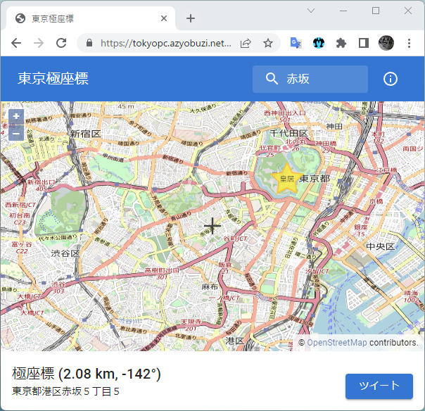

# 一発屋サービス「東京極座標」をリリースしました

みなさんは東京の土地勘ありますか？ 私は東京で生まれ育ちましたが、未だに赤坂がどこにあるのかいまいちピンと来ません。ただ都心であることは間違いないでしょう。

東京の中心は、言わずもがな、かつての江戸城、現在の皇居です。道路や鉄道は皇居を中心とした同心円状に整備されています。例えば、道路では、環状1～8号線、首都高都心・中央線環状線があります。東京メトロの主要な路線は、東京23区の端から、皇居を半周して、山手線の駅に繋がるような構成になっています。

逆に言えば、皇居は不可侵の場所です。皇居の上を越えていくことはできません。したがって、東京を攻略するには皇居をどっちまわりで抜けていくかを知ることが重要であり、そのためには目的地が皇居からみてどの方角にあるかを知る必要があります。

そこで私はかねてからアイデアがありました。東京はもう住所を廃止して極座標（皇居から見た方角と、皇居からの距離）で表すべきだと。

そしてついに、これを簡単に実現する Web サービスをつくりました！！！

[東京極座標 https://tokyopc.azyobuzi.net/](https://tokyopc.azyobuzi.net/)

<figure class="fig-img">

</figure>

このサービスのおかげで、赤坂が皇居の南西2kmにあることがわかりました！ このことから、赤坂のお高いイメージは皇居に近いことが影響しており、また普段なぜ縁がない場所かといえば、私は総武線（皇居をの北側を通って東西へ抜ける）沿線の民なので南西方向に行かないからということがわかります。このように東京極座標は、東京攻略を有利にすることができるのです。

## 技術的な話

一発屋サービスに対してそれっぽい説明を書くのは疲れたので技術構成の解説をします。

UIデザインをする元気はないので、UIフレームワークには、それっぽい見た目をさっとつくれる [MUI](https://mui.com/) を採用しました。これは手癖です。バンドラーに [Vite](https://vitejs.dev/) をつかったのは初めてでしたが、 React 用の初期設定を特に何も変更せず使えて便利でした。

地図の表示には [OpenLayers](https://openlayers.org/) を使用し、 [OpenStreetMap](https://www.openstreetmap.org/) の地図を表示しています。住所から座標を検索したり、座標から住所を求めたりするのには Google Maps Platform を使用しました。 Google Maps Platform は無料枠を超えたあとの課金がやばそうなので避けようとしましたが、寄付で成り立っている OpenStreetMap のジオコーディング API サーバーを検討したところ、利用制限のガイドラインを守れるか不安だったので、地図だけ OpenStreetMap、ジオコーディングは Google Maps Platform という構成になっています。

そして、一番手が込んでいるのが、極座標の下に表示されている住所表示の部分です。実際に操作してみるとわかると思いますが、地図をドラッグして、少ししてから住所が更新されます。これはジオコーディング API のコール回数を削減しつつ、ストレスなく住所を確認できるよう検討した結果の仕上がりです。複雑な時間と非同期処理の制御が必要なため、 Rx で書き下したいと考え、状態管理と合わせて [redux-observable](https://redux-observable.js.org/) を採用しました。座標の変化を受け取り一定時間座標が変化せず、かつ前回の住所取得が完了しているならば、新たな住所を取得する、といったロジックを組みました（[該当ソースコード](https://github.com/azyobuzin/tokyopc/blob/30b78300ee86f24dc6cc7438ff4f904d6c0608fb/src/store/epics/reverseGeocodingEpic.ts)）。 Rx は頭の体操感があります。

## おわりに

社会人になってからブログを書いてなかったし、そもそも趣味開発も疎かになっていたので、久々に個人開発したぞ！という感じです。せっかく自分でブログを整備しているので、もっとアウトプットがんばるぞ！
