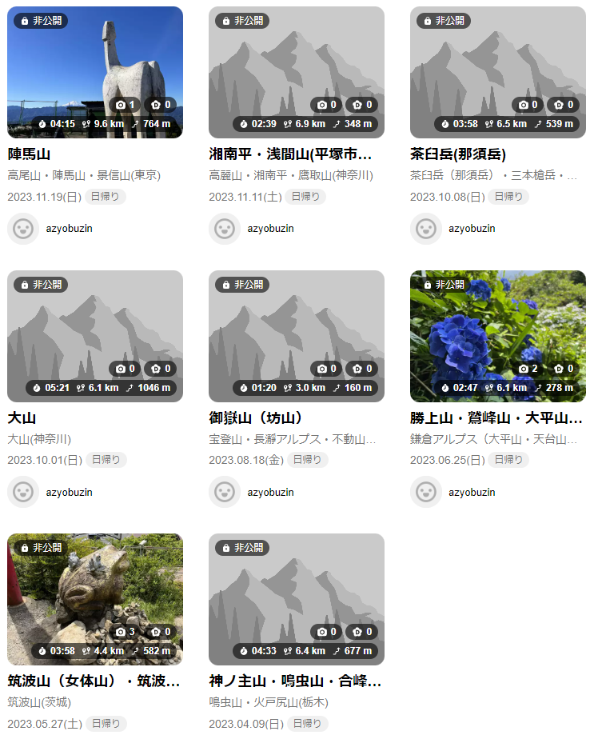

# 新年のご挨拶と近況報告2024

あけましておめでとうございます。ついぞ2023年はブログを一件も投稿しませんでしたが、生きてます。

1月1日午前4時、犬吠埼にいて、初日の出を待ちながらブログを書いています。PCを車で運びながら充電してたら、若干バックライトがいかれて悲しい。

## 2023年、何してたんや

年を振り返るなら2023年中にしとけや。わかる。ただそんなやる気も出なかったので許して。なんなら最近PC触るのもやる気が出てない。

### 労働

社会人になって1年半が経ちました。仕事ではもっぱら Ruby on Rails を触っています。e-Taxの仕様書と向き合う仕事とかしてます。フルタイムで開発してると、趣味でもコード書こうという気がだんだん起きなくなってきて、無事つまらない社会人になってしまいました。中途採用の面接官もやってるのですが、自分のことは棚に上げてプライベートでの技術興味とか聞いてます、許して。

仕事では、プロダクト自体は面白くて、改善していくのはやりがいがあるのですが、技術的にあんまりチャレンジングではないです。だからこそ、チャレンジングなネタを自分で生み出して、コスパを示してリードしていくのが今後の課題です。

### 埼玉県民になりました

翔んで埼玉は未履修です。

東京で生まれ育ってきましたが、ついに実家を出ました。今は1km以内に田畑が広がる地に住んでいます。たまにでかい虫が家の中に入ってきてビビり散らかしてますが、安くて広い家を借りられて快適です。

そういえば、ゴールデンウィークに引っ越した関係で、マイナンバーカードの署名用電子証明書が無効になったままだった。そのうち更新します。

### 登山を趣味にしようとしている

私の体は、走る体力はなくても、歩くのだけは無限にできるみたいです。昔から歩くのは好きだったのですが、その延長として山に登るようになりました。

YAMAPを見ると、2023年は8回の登頂記録があります。初心者なので3～5時間くらいで完走できるようなコースにちょくちょく出かけています。

<figure class="fig-img">

</figure>

夏と冬は過酷なので、また春になったらやっていきます。

### 教習所に通っている

12月から中型自動車免許を取るために教習所に通っています。理由は、ただの趣味です。でかい車を運転する経験したくない？

軽い気持ちで始めたものの、スケジュールがかなりハードで、第1段階5時間、第2段階6時間で終わりです。教習車のトラックの挙動は、やはり普通車とは全然違くて、慣れる前に終わってしまいそう。普通車の免許を取ったときくらいの手厚さを想像してたので、びびっています。

12月中に仮免許の取得まで終わったので、今年は路上教習からスタートです。

## 2024年は

なによりも体力。体力がないと無をして終わってしまうので、体力を増やすぞ！って10月くらいにも言ってたのですが、寒さにやられました。冬は無理。春になったら頑張ります。

あとは、ブログを書けるように、もうちょい技術で遊ぶなり、ネタになるように写真撮ったりするべきですね。

2023年も皆様のお付き合いありがとうございました。今年もよろしくお願いします。
