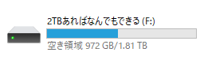
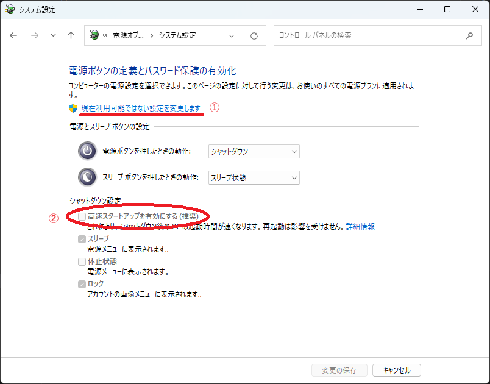
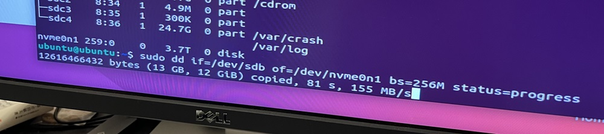

# やっとNVMe時代のSSDを買ったのでddコマンドでデータ移行した話

Forza Motorsport 新作が出てたことを思い出した（今更）ので、 Xbox Game Pass で遊ぶことにしました。前作からすでにそうですが、このゲームは容量が 100GB 以上あります。

私の PC には 1TB の SATA 接続 SSD と、 2TB の HDD が接続されていました。すでに SSD のほうは残り容量がカツカツなので HDD のほうに入れることに。予想はしていたのですが、 HDD は時代遅れなほど遅いので、コースのロードに1分くらい待つことになるのでストレスフルでした。

<figure class="fig-img">

<figcaption>2TBあればなんでもできるはずだったHDD</figcaption>
</figure>

そこでついに重い腰を上げて、新しい SSD を購入しました。買ったのは CFD のミドルくらいの 4TB モデル (<a href="https://amzn.to/3wsydBk" target="_blank" rel="external">CSSD-M2L4KSFT6KE</a>)。 Amazon で3万を切ってたので買いだと思って購入しました。

で、ここからが本題。 Windows をクリーンインストールする元気はないので、**どうにかして前の SSD から新しい SSD にデータを移行したい**です。数年前にも同じことやってるのですが、やり方をメモしてなかったので、備忘録としてメモしておきます。

## 前提

- Windows が入ったディスクを別のディスクに移行したい
- 移行元のディスクと移行先のディスクは両方ともPCに接続されている
  - 今回は SATA SSD → M.2 SSD なので両方同時に接続可能でした
- BitLocker を使っていない （たぶん使ってたら面倒なことになる）

必要なもの

- USBメモリ (16GBあれば安心)
- BIOS / UEFI の設定を躊躇なく触れるリテラシー
- バックアップなしで実行するので、ミスってもくじけない強い心

## 1. 高速スタートアップを無効化する

こういう作業をするとき事故の原因になるのが Windows の高速スタートアップ機能です。シャットダウン時の状態を特別な領域に保存しているので、このまま別の OS を起動すると何らかおかしいことが起こります（移行完了後に起動したらブルースクリーンになったことがある。1敗）。まずは高速スタートアップを無効化しましょう。

高速スタートアップの設定は、 [コントロール パネル] → [ハードウェアとサウンド] → [電源ボタンの動作の変更] にあります。 [現在利用可能ではない設定を変更します] をクリックして管理者権限に昇格したあと、 [高速スタートアップを有効にする] のチェックを外して [変更の保存] をクリックしてください。

<figure class="fig-img">

</figure>

## 2. Ubuntu のライブ USB をつくって起動

何の Linux ディストリビューションでも良いですが、個人的な趣味で Ubuntu を前提に進めていきます。

まず USB メモリに Ubuntu を入れていきます。

1. <a href="https://ubuntu.com/download/desktop" target="_blank" rel="external">https://ubuntu.com/download/desktop</a> から ISO ファイルをダウンロード
2. <a href="https://etcher.balena.io/" target="_blank" rel="external">Etcher</a> で ISO ファイルを USB メモリに焼く

（ただ ISO ファイルを焼くだけにも、最近は Etcher なんてリッチな UI のアプリがあるんだなぁ）

あとは作った USB メモリからブートして、 Try Ubuntu を選択してください。私の環境だと「Try or Install Ubuntu」がうまく動かなかったので safe graphics モードを使用しました。

## 3. 移行元ディスクと移行先ディスクを確認する

Ubuntu が起動したら Disks アプリを起動します。起動したら、容量やパーティション構成を頼りに移行元ディスクと移行先ディスクを特定します。特定したらデバイスのパスをメモしておきます。

<figure class="fig-img">

<figcaption>ヘッダーのところに書いてあるのをメモする</figcaption>
</figure>

私の環境では、移行元ディスクが /dev/sdb 、移行先ディスクが /dev/nvme0n1 でした。

## 4. ddコマンドで中身をコピーする

デバイスを特定したら、ディスクの中身を丸ごとコピーします。1バイト足りとも違わない完璧なコピーを作ります。

1. ターミナルを起動
2. `sudo dd if=移行元 of=移行先 bs=適当な値` を実行
   - 移行元・移行先は Disks で確認したパスを入力 (例: `if=/dev/sdb if=/dev/nvme0n1`)
   - bs は小さすぎるとコピーが遅くなるので、メモリが許す限り適度に大きくします。私の場合は `bs=256M` を指定しましたが、これが最速かはわかりません。

あとは1時間くらい放置です。ここで if と of を間違えてたら事故なので泣いてください。

<figure class="fig-img">

<figcaption>実行中の様子</figcaption>
</figure>

## 5. 後は流れで

コピーが完了すると、完全に同じパーティションテーブルを持った、ふたつのディスクが存在することになります。この状態で PC を起動すると UEFI は接続順でどちらか片方しか認識しなくなります（マザーボード次第かも）。心配な場合は PC の電源を切ったあと、移行元のディスクを外してから Windows を起動しましょう。私の環境では運よく移行先が優先されてたので、そのまま使っています。

移行元ディスクを別の用途に使うならば、 Ubuntu 上の Disks や Gparted でパーティションテーブルを作り直すなり、 Windows で diskpart を使って空にするなりすれば、新たに使えるようになるはずです。
