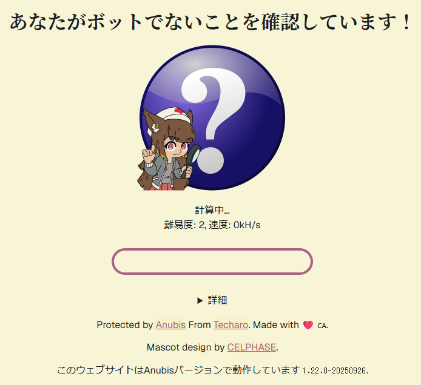

# ForgejoにAnubisを導入した

悪名高いAnubisだが、さすがにサーバー負荷高すぎて操作不能なのでやむなし……。

<figure class="fig-img">

<figcaption>Anubisによるbotチェック画面。無駄にハッシュ計算させられるなど、なかなか邪悪。</figcaption>
</figure>

相変わらずPleromaサーバーの運営を続けているわけですが、そのソースコードを管理するためにForgejoサーバーを立てています。一時期はAWS上で動いていましたが、絶えず続くスクレイパーからのリクエストで結構な金額がかかっていました。そこで自宅のノートPCに移行してみたのですが、自分の作業のために使うにも重すぎて、使い物になりませんでした。

ここで、スクレイパーに対する僕の立場を表明しておきます。

- robots.txtは設定済み。特にインデックスしても面白いものはないので、全部Disallowしてあります。
- AIに学習されることは何ら構いません。
- でも、重いリクエストを無駄に投げられることは勘弁。

まずはリバースプロキシとして使っているnginxだけで何とかできないか考えましたが、limit_reqやlimit_connだけでは、通常の人間の操作まで邪魔してしまう設定しかできずに断念しました。というのも、スクレイパーによる被害は、リクエスト数が多いことではなく、重いエンドポイント（昔のコミットを見たり、blameしたり、リポジトリ全体アーカイブzipをダウンロードしたり）へのアクセスでした。例えば1分間に2リクエストまで許可する、みたいな制限をかけたとしても、2回リポジトリ全体ダウンロードをやられたらたまったもんじゃないです。さらに、同時にやってくるスクレイパーは数種類いるっぽく、IPアドレス単位で制限してもすり抜けられます。

というわけで、嫌いで仕方なかったAnubisに手を出すことにしました。

## 別にハッシュ計算させなくていい

Anubisといえば、アクセスするたびにハッシュ計算を求めてくる環境に悪い邪悪なプロキシで、これのせいでAI Agentから読めないドキュメント (OpenWrt Wiki、お前のことだぞ) もあって、結構ブチ切れていました。

しかし、Anubisのドキュメントを読んでみると、ハッシュ計算させる以外にも

- `<meta http-equiv="Refresh" />` によるリダイレクトを挟む (metarefresh)
- JavaScriptでチャレンジエンドポイントにPOSTする (Preact)

という設定があることがわかりました ([Challenge Methods | Anubis](https://anubis.techaro.lol/docs/admin/configuration/challenges/))。

今回の目的では、aタグを手あたり次第アクセスしてくるスクレイパーをブロックできれば良いので、Preactかつ表示時間を最小にすれば良さそうです。これなら一瞬で表示されるし、体験も悪くないぞ！

## botPolicies.yamlを書く

Anubisはリバースプロキシとして動くので、アプリケーションの前段にDockerコンテナとして設置するだけで簡単に導入できます。ただ、デフォルト設定はAI・スクレイパー断固拒否！みたいな強気の設定です。今回の目的は重いページへのリクエスト前にスクレイパーチェックが走ればよいだけなので、緩めの設定を考えます。

最小構成では、botsセクションとthresholdsセクションを置くと良いです。botsセクションのルールを上から順番に評価し、それまでにactionがあればそのactionが実行される。そうでなければ重みに応じたactionを実行する、という構成ですね。

<figure class="fig-code">
<figcaption>最小構成のbotPolicies.yaml</figcaption>

```yaml
bots:
  - name: ルール1
    条件
    action: ALLOW

  - name: ルール2
    条件
    action: WEIGH
    weight:
      adjust: 1

thresholds:
  - name: minimal-suspicion
    expression: weight <= 0
    action: ALLOW

  - name: moderate-suspicion
    expression: weight > 0
    action: CHALLENGE
    チャレンジの設定
```

</figure>

botsセクション側にCHALLENGEを書いてもよいのですが、今後CHALLENGEさせたい条件が増えたときに面倒になるので、重みに寄せておくと便利なはずです。

さて、Forgejoではどのようなルールを設定すべきでしょうか。今までのアクセスログで1リクエストの時間が長くて重いリクエストは、大体リポジトリのarchive, blame, commit, commits, srcあたりのパスでした。なので、このあたりをCHALLENGE対象にしておきましょう。逆に、フロントエンドアセットのダウンロード、認証されたAPIアクセス、Git HTTP ProtocolにAnubisが介入されると困るので、このへんは重みをつける前にALLOWしておきます。

現在運用している設定はこうなりました。

<figure class="fig-code">
<figcaption>運用中のbotPolicies.yaml</figcaption>

```yaml
bots:
  # 静的アセットは通す
  - name: forgejo-assets
    path_regex: (^/assets/|^/favicon\.ico$|^/robots\.txt$|^/.well-known/)
    action: ALLOW

  # Git HTTP / API token / Basic 認証っぽいものは通す
  - name: forgejo-authorization
    headers_regex:
      Authorization: .+
    action: ALLOW

  # Git HTTP Protocolは通す https://git-scm.com/docs/http-protocol
  # 公開 repo の clone/fetch は Authorization なしで来る可能性があるため
  - name: forgejo-git-http
    path_regex: ^/[^/]+/[^/]+/(info/refs|objects/|git-upload-pack|git-receive-pack)
    action: ALLOW

  # 重いリクエストはウェイトを設定
  # archiveはPOSTをブロックするとフロントエンドからアーカイブダウンロードができなくなるので、GETに限定している
  - name: forgejo-heavy-path
    expression:
      all:
        - method == "GET"
        - path.matches("^/[^/]+/[^/]+/(archive|blame|commit|commits|src)/")
    action: WEIGH
    weight:
      adjust: 1

thresholds:
  # 重みなしなら何もしない
  - name: minimal-suspicion
    expression: weight <= 0
    action: ALLOW

  # 重みが設定されたら、1秒だけAnubisの画面を表示
  - name: moderate-suspicion
    expression: weight > 0
    action: CHALLENGE
    challenge:
      algorithm: preact
      difficulty: 1
```

</figure>

Cookieにセッションが入ってたらALLOWみたいな設定を入れると、ログインしていればAnubisとは一切無縁になれるのでなお良いかもしれません。今回の設定では、動いてることをデバッグしやすいように、あえてその設定は入れませんでした。

## 結果

次の動画のように、一瞬でページ遷移され、ほぼストレスなく利用できるように設定できました。

<figure class="fig-img">
<video controls src="commits.mp4"></video>
<figcaption>ForgejoでAnubisが動作している様子</figcaption>
</figure>

導入後、スクレイパーによって動作が重くなることもなく、快適に使えています。

というわけで、みなさん、初期設定で使わないで、めちゃくちゃ簡易な設定で試してみてください。効果は絶大、体験はめちゃくちゃいいです。あと静的コンテンツのサーバーはAnubisを入れる前にキャッシュでなんとかしてくれ頼む。AIにドキュメントを読まさせてくれ！
