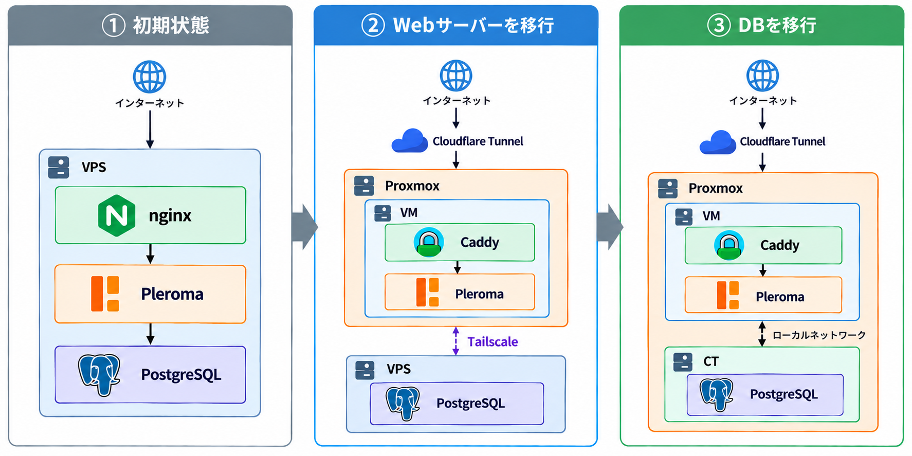
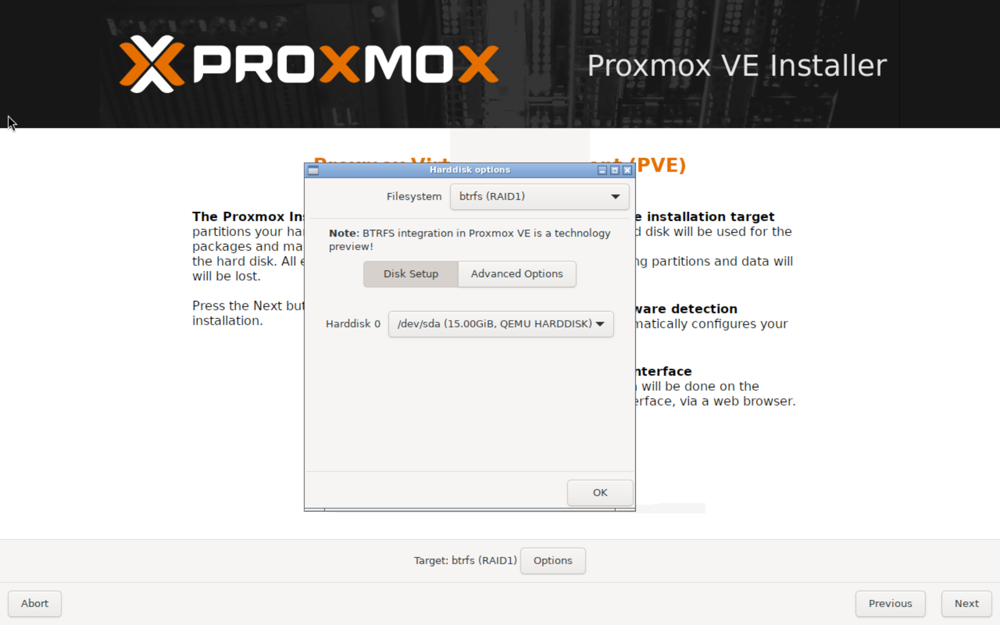
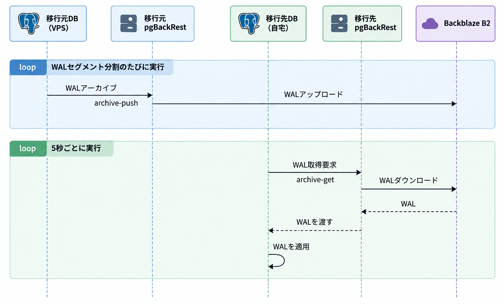

# ご隠居を自宅サーバーに移行した

ふらっとハードオフに行ったらメモリ16GBのPCが3万円で落ちてたので買ってしまいました。せっかくなので、Proxmox VEを入れて、[Pleromaサーバー「ご隠居」](https://xxx.azyobuzi.net/)をVPSから自宅に移行してみたので、その学びを書いていきます。

## 構成 Before / After

もともとご隠居はKAGOYA CLOUD VPSで動いていました。遡ってみると、KAGOYAに移行したのは3年半前ですね、長いこと使っていました。相変わらずケチケチな運用をしているので、メモリ4GBのVPS 1台でDockerとPostgreSQLを運用する形式をとっていました。VPS上にはHTTPをlistenする1つのnginxが動いており、nginxがご隠居を含めたすべてのサービスにリバースプロキシしていました。

新構成では、Proxmoxをテクニカルプレビューであるbtrfsでインストールした上で、Webサーバー用のVMと、DB用のCT(LXC)を用意しました。VMとCTで分かれているのは、同居しているForgejoの構成の都合です。

残念ながら自宅にはグローバルIPv4アドレスがないので、Cloudflare Tunnelでインターネットに公開しています（敗北感）。Cloudflare TunnelがHostの判定、TLS終端をしてくれるようになるので、nginxは廃止しました。ただし、メンテナンス中に503を配信したり、画像の配信をPleromaにやらせないようにする最適化を入れたりする必要があるので、サイドカーとしてCaddyを導入しました。

移行作業は、自宅の回線の様子を見ながら、微妙なら切り戻す判断ができるよう、2回の停止メンテで行いました。

1. Webサーバーの移行。メンテナンスモードに入れてリクエストを受け入れない状態にした上で、旧環境へのDNSレコードを削除し、Cloudflare Tunnelの設定を有効化しました。Cloudflareでは、Tunnelで使うサブドメインのDNSレコードは事前に削除しないと中途半端な構成になって壊れます（検証環境で1敗）。旧環境はメンテナンスモードのまま放置し、新環境のメンテナンスモードを解除することで、DNSが浸透したユーザーから復旧するようにしました。DBは旧サーバーに残ったままで、新サーバーのVMから旧サーバーへTailscaleを使って接続しました。
2. DBの移行。もともとpgBackRestを使っていたので、pgBackRestのWALアーカイブを使ったレプリケーションを組みました。後で詳しく説明します。

<figure class="fig-img">

<figcaption>移行中の構成（ChatGPTで生成）</figcaption>
</figure>

## Proxmoxのbtrfsサポート

Proxmoxをデフォルト構成でインストールするとLVMになりますが、触ってみたところ微妙でした。LVM構成でインストールすると、システム用に1/4くらいのパーティションが切られて、残りがVMディスク用になります。マシンが積んでるSSDは256GBで、DBが80GBくらいあることを考えると、だいぶVM用ディスクがカツカツになることが予想されました。btrfsならばディスク全体をフラットに扱えるということで、btrfsにしてみました。

<figure class="fig-img">

<figcaption>インストーラでbtrfsを選択。スクショは実機ではない。</figcaption>
</figure>

### CTのディスクを普通のsubvolumeにする

btrfsでVM・CTを作成すると、ディスクイメージは `/var/lib/pve/local-btrfs/images/100/vm-100-disk-0/disk.raw` という単一のファイルに保存されます。スナップショットが取れるよう、このディレクトリはsubvolumeになっています。

<figure class="fig-code">
<pre>/var/lib/pve/local-btrfs/images/100/vm-100-disk-0 ← btrfsのsubvolume
└ disk.raw ← 指定したディスクサイズのファイル</pre>
<figcaption>通常のディスクイメージの配置</figcaption>
</figure>

VMではそれはそうという感じですが、せっかくbtrfsなんだからCTでは普通にsubvolumeを切って、そこにCTのルートディレクトリが置かれて欲しいですよね。

Proxmoxのドキュメントを見てみると、CTを作成するときにディスクサイズを0にすると特別扱いしてくれる、とあります\[[pct(1)](https://pve.proxmox.com/pve-docs/pct.1.html#_storage_backed_mount_points)\]。残念ながらGUI上からはディスクサイズを0にすることはできません。 `pct create` コマンドでCTを作成する必要があります。

```sh
pct create 100 local-btrfs:vztmpl/TEMPLATE --rootfs local-btrfs:0 ...他のオプション
```

こんな感じでコマンドから `--rootfs local-btrfs:0` オプションをつけてCTを作成すると、ディスクイメージは次のように、普通のディレクトリになります。

<figure class="fig-code">
<pre>/var/lib/pve/local-btrfs/images/100/subvol-100-disk-0.subvol ← btrfsのsubvolume
├ bin
├ boot
└ ...</pre>
<figcaption>ディスクサイズを0にしたときのディスクイメージの配置</figcaption>
</figure>

これでdisk.rawという単独ファイルを回避することができ、ディレクトリ単位でCoWを無効化したり、他のCTのイメージとdedupしやすくなったりするはずです。

ただしひとつ罠があります。CT内から見るとルートディレクトリのパーミッションが740になっています。これだとrootユーザー以外はあらゆるディレクトリにアクセスすることができません。実際、ネットワークがupしませんでした。そのため、 `--rootfs local-btrfs:0` を指定してCTを起動したら、まずはじめに `chmod 755 /` を実行して再起動する必要があります。

## AnsibleでProxmoxのCTにアクセスする

Ansibleで構成管理をしています。AnsibleはSSHがあればどこでも接続できますが、CTそれぞれすべてにSSHの経路を用意するのもなぁと思っていたところ、ProxmoxのホストへのSSH経路だけ用意すればCTを操作してくれるAnsibleのプラグインがありました。

使い方は簡単で、インベントリファイル（hosts.yml）に次のようにホストを追加するだけです。

```yaml
foo_group:
  hosts:
    ct103:
      ansible_host: SSH接続できるProxmoxのホスト
      ansible_user: root # Proxmoxホスト側のユーザー
      ansible_connection: community.proxmox.proxmox_pct_remote
      proxmox_vmid: 103 # CT ID
```

「community.proxmox」はcommunity collectionなので、通常のAnsibleに含まれています。明示的にインストールする場合はansible-galaxyでインストールできます。

このコネクションプラグインは、内部ではProxmoxホストへSSHで接続して `pct exec` を実行します。したがってAnsibleの操作は、becomeを指定しない限りCT内のrootユーザーで実行されます。

## pgBackRestを使ったDB移行

ご隠居サーバーのPostgreSQLのバックアップには以前からpgBackRestを使ってきました（[以前紹介したpg_rman](https://blog.azyobuzi.net/2022/12/31/01-pgrman/)から移行しました）。定期的なフルバックアップとWALアーカイブをBackblaze B2にアップロードしており、基本的には障害が起きても失われるデータは数分程度となっています。

さて、DBを移行するにあたって、愚直にバックアップ→リストアを実行すると、回線速度依存ではありますが、2時間くらいダウンタイムが生じる予定でした。そこでふと、WALアーカイブがあるんだから非同期レプリケーションすればダウンタイムを短くできるのでは？と思い調べてみたところ、pgBackRestのrestoreコマンドのオプションに `--type=standby` というドンピシャの機能がありました。

standbyというオプションが何をしてくれるかというと、まず普通にバックアップからPGDATAディレクトリを復元した後、 `restore_command = 'pgbackrest archive-get %f "%p"'` と書かれたコンフィグファイルと、 `standby.signal` というファイルを残します。これらのファイルが残った状態でPostgreSQLを起動すると、5秒おきに<var>restore_command</var>に書かれたコマンドを実行して、成功したらそのWALアーカイブを適用するという動作をし続けます。つまりほぼ最新のWALアーカイブを読み込み続けてくれるわけです。

<figure class="fig-img">

<figcaption>pgBackRestを使った非同期レプリケーションのシーケンス図（ChatGPTで生成）</figcaption>
</figure>

これを利用すれば、停止メンテに入る前にほとんどのデータが新環境のDBにコピーできている状態にできます。停止メンテでは、新環境に最新のWALアーカイブが適用されたことを確認した後 `SELECT pg_promote();` を実行することで、リストアを終了します。

移行作業の実際の手順書は、こんな感じでした。

1. 定期バックアップを停止する
2. メンテナンスモードに入れる
3. アプリコンテナを停止する
4. 移行元DBで `SELECT pg_current_wal_lsn();` でLSNを確認 → `56B/C0EE000` （WALアーカイブの最後）
5. 移行元DBで `SELECT pg_switch_wal();` を実行 → `56B/C0F8B80` （WALアーカイブの最初）
6. 移行先DBで `SELECT pg_last_wal_replay_lsn();` し、移行元のLSN以上であることを確認 → `56B/E000000`
7. 移行元DBを停止 `sudo pg_ctlcluster stop 18 main`
8. 移行先DBで `SELECT pg_promote();`
9. composeの環境変数を変更
10. アプリコンテナを起動して動作確認

## おわり

そんなこんなで30分程度の停止メンテ2回で、無事ご隠居サーバーを自宅に移行することができました。初めてPostgreSQLでちょっとしたレプリケーションをやってみましたが、思ったより簡単でした。pgBackRest便利ですね。

ところで、この記事を書いてる間にメインPCのSSDがお亡くなりになって、非常に困っています。つらい。
